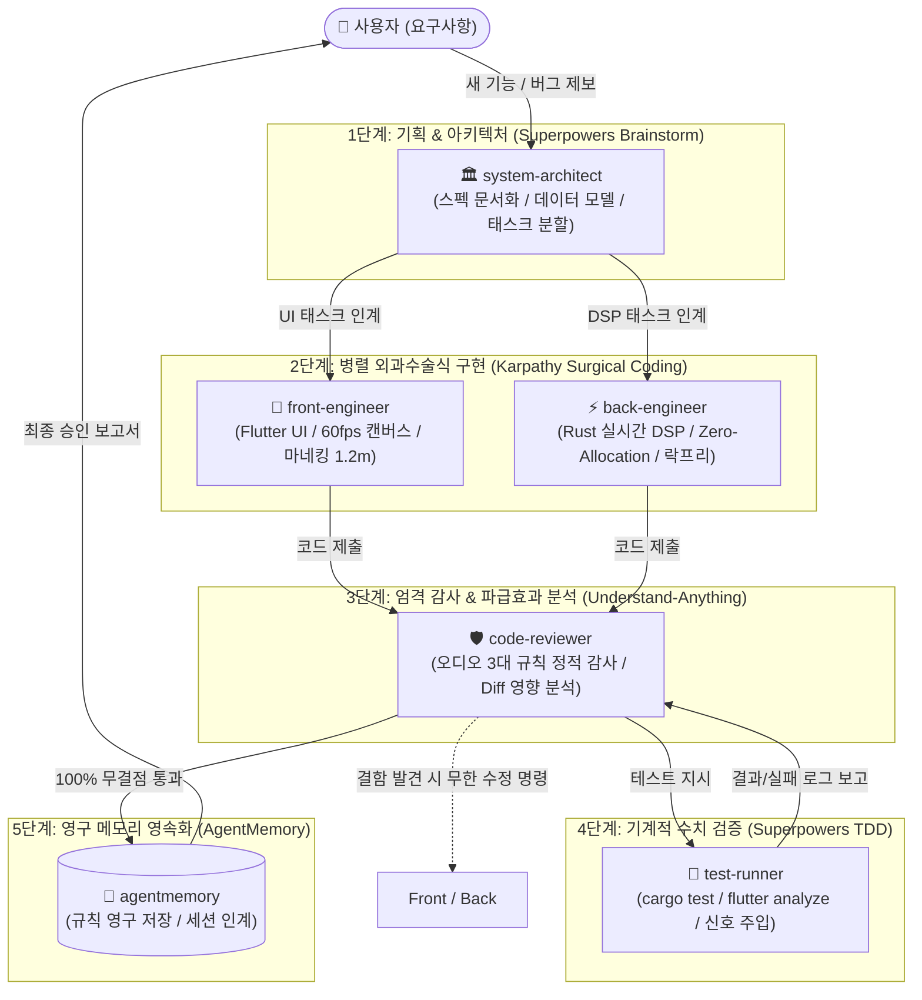

# 🏛️ Atmos Mixer Pro: 5대 에이전트 상세 명세 및 엔드투엔드 워크플로우 마스터 규격서
> **문서 버전:** v2.0.0 (Agentic Multi-Role Master Spec)  
> **적용 표준:** 프로 오디오 3대 불변법칙 + 카파시 4대 원칙 + 슈퍼파워즈 TDD + 언더스탠드 애니띵 + 에이전트메모리

---

## 1. 🌐 총괄 아키텍처 개요 (Overview)

본 규격서는 **Atmos Mixer Pro**의 자율 개발 및 품질 관리를 수행하는 **5대 특화 서브에이전트**의 역할, 권한, 입출력 규격, 그리고 이들이 유기적으로 협업하는 **7단계 무결점 순환 워크플로우(7-Step Loop)**를 명문화한 마스터 설계서입니다.



---

## 2. 👥 5대 에이전트 상세 명세 (Agent Detailed Specifications)

---

### [에이전트 1] `system-architect` (수석 시스템 아키텍트 / 기획 총괄)
* **호출 파일:** `.claude/agents/system-architect.md`
* **역할 및 페르소나:** 전체 시스템 설계, 기획 스펙 작성, 데이터 모델 정의, 태스크 분할 총괄.
* **사용 도구 (Tools):** `Read`, `Grep`, `Glob`, `Edit` (문서 작성 전용), `Bash` (비파괴적 조회 전용)
* **적용 스킬:** `superpowers-workflow` (`/brainstorm`, `/write-plan`), `understand-anything`
* **주요 책무 (Responsibilities):**
  1. **요구사항 심층 분석 (Think Before Coding):** 모호한 요청을 자의적으로 코딩하지 않고 기술적 전제와 트레이드오프(CPU 부하, 오디오 지연 등)를 사전 분석.
  2. **설계 문서 산출:** `docs/01_Architecture/` 및 `docs/02_Planning_and_Specs/`에 표준 기술 명세서 작성.
  3. **데이터 모델 & 스키마 무결성:** `config.json` 직렬화 규격과 Rust `AppConfig` ⇄ Dart 모델 간 1:1 정합성 사전 정의.
  4. **물리 표준 사전 반영:** 청취자 마네킹 귀 높이 $1.2\text{m}$ (`W/2, D/2, 1.2m`) 및 DBAP 에너지 보존 수식을 설계에 강제.
  5. **원자 단위 태스크 분할:** `front-engineer`와 `back-engineer`가 독립적으로 개발할 수 있는 체크리스트 단위 작업표 전달.

---

### [에이전트 2] `front-engineer` (프론트엔드 수석 엔지니어)
* **호출 파일:** `.claude/agents/front-engineer.md`
* **역할 및 페르소나:** Flutter macOS 네이티브 UI, 60fps/120Hz 고주파 캔버스 렌더링, 3D 뷰어 및 FFI 연동.
* **사용 도구 (Tools):** `Read`, `Grep`, `Glob`, `Edit`, `Bash`
* **적용 스킬:** `karpathy-guidelines` (Surgical Changes, Simplicity First)
* **주요 책무 (Responsibilities):**
  1. **외과수술식 최소 변경 (Surgical Changes):** 수정 대상 위젯 외의 인접 레이아웃, 주석, 포맷을 절대 건드리지 않음.
  2. **60fps/120Hz 무렉(Zero-Lag) 캔버스:** 전체 화면 리빌드를 막기 위해 `Listenable`, `ValueNotifier`, `RepaintBoundary`를 필수 적용하여 페인팅 영역 분리.
  3. **3D 리스너 룸 연동:** `assets/models/listener_head.glb` 에셋 렌더링 및 $1.2\text{m}$ 귀 위치 기준 스피커 방사각 시각화.
  4. **FFI 바인딩 연동:** `flutter_rust_bridge`를 통해 Rust DSP 엔진과 비동기 스트림 데이터 무지연 송수신.

---

### [에이전트 3] `back-engineer` (오디오 DSP 수석 엔지니어)
* **호출 파일:** `.claude/agents/back-engineer.md`
* **역할 및 페르소나:** Rust 실시간 오디오 엔진, 저지연 오디오 드라이버(CoreAudio/ASIO), 공간음향 수식 구현.
* **사용 도구 (Tools):** `Read`, `Grep`, `Glob`, `Edit`, `Bash`
* **적용 스킬:** `atmos-pro-audio-dsp`, `atmos-spatial-audio`, `karpathy-guidelines`
* **주요 책무 (Responsibilities):**
  1. **Zero-Allocation (100% 무할당):** 오디오 콜백 루프(`process()`) 내 `Vec::new()`, `vec![]`, `String`, `Box` 동적 메모리 할당 100% 차단. (모든 버퍼는 생성자 `new()`에서 사전 할당)
  2. **Lock-Free Concurrency (100% 락프리):** 오디오 스레드 내 `Mutex::lock()`, `println!()`, 디스크 I/O 절대 금지. `rtrb` SPSC 링버퍼 및 원자적 변수(`AtomicU32`, `AtomicBool`)만 사용.
  3. **Sample-Accurate Lerp (지퍼 노이즈 제거):** 60fps UI/OSC 파라미터 유입 시 즉시 스냅 금지, 오디오 버퍼 단위 선형 보간 필수 적용.
  4. **3D 알고리즘 정밀 구현:** DBAP 에너지 보존 수식($\sum g_i^2 = 1$), LR4 크로스오버($0^\circ$ 위상 정합), Catmull-Rom 스플라인 등속도 궤적 연산.
  5. **Windows & macOS 크로스플랫폼:** `#[cfg(target_os = "windows")]` (ASIO/WASAPI) 및 `#[cfg(target_os = "macos")]` (CoreAudio) 정합 분기.

---

### [에이전트 4] `code-reviewer` (품질 감독관 / 품질 게이트키퍼)
* **호출 파일:** `.claude/agents/code-reviewer.md`
* **역할 및 페르소나:** 코드 리뷰, 오디오 3대 규칙 정적 감사, 파급 효과 분석, 테스트 지휘 및 최종 승인권자.
* **사용 도구 (Tools):** `Read`, `Grep`, `Glob`, `Bash` (비파괴적 감사 전용)
* **적용 스킬:** `understand-anything` (`/understand-diff`), `atmos-zero-defect-workflow`
* **주요 책무 (Responsibilities):**
  1. **실시간 오디오 3대 금기 정적 감사:**
     - Rust 파일 전수 조사: `grep -rn "Vec::new" rust/src/`, `grep -rn "Mutex::lock" rust/src/`, `grep -rn "println\!" rust/src/`
  2. **파급 효과 분석 (Diff Impact Analysis):**
     - 변경된 Rust C-struct 바이트 정렬(`#[repr(C)]`)과 Dart FFI 모델 크기가 일치하는지, Riverpod 구독 위젯에 파괴적 변경이 없는지 사전 판정.
  3. **무한 결함 시정 지시 (Zero-Tolerance):**
     - 단 하나의 경고나 테스트 실패라도 발생하면 완료 선언을 기각하고 `front-engineer` 또는 `back-engineer`에게 에러 원인과 함께 즉각 수정 명령.
  4. **최종 승인 보고서 발급:** 100% 무결점이 입증된 경우에만 최종 완료를 승인.

---

### [에이전트 5] `test-runner` (자동화 테스터 / QA)
* **호출 파일:** `.claude/agents/test-runner.md`
* **역할 및 페르소나:** 무자비한 기계적 테스트 실행, 모의 신호 주입, 터미널 로그 취합 및 결함 리포트.
* **사용 도구 (Tools):** `Read`, `Grep`, `Glob`, `Bash`
* **적용 스킬:** `superpowers-workflow` (TDD Execution), `atmos-zero-defect-workflow`
* **주요 책무 (Responsibilities):**
  1. **기계적 빌드 및 린트 검증:**
     - `cd rust && cargo test -- --nocapture` (0 Failure)
     - `flutter analyze` (0 Issues)
     - `cargo clippy` (0 Warnings)
  2. **모의 신호 주입 수학적 판정 (Mock Signal Injection):**
     - **1kHz Sine Wave (0dBFS) 주입:** 대상 주파수 외 대역 -140dBFS 감쇠 확인.
     - **Digital Silence (0.0) 주입:** CPU 데노멀(Denormal) 방지 및 -140dBFS 안정화 확인.
     - **Impulse 주입:** 필터 응답 곡선 오차 0.001% 미만 기계적 검증.
  3. **로그 취합 및 인계:** 날것의 에러 로그를 명확히 구조화하여 `code-reviewer`에게 인계.

---

## 3. 🔄 엔드투엔드 7단계 무결점 워크플로우 (End-to-End Pipeline)

---

### [Step 1: 브레인스토밍 및 아키텍처 설계]
- **주관:** `system-architect`
- **행동:**
  - 사용자 요구사항 청취 및 모호성 해소 (Karpathy 원칙).
  - `docs/`에 기능 설계 명세서 및 데이터 스키마 작성.
  - UI 작업 항목과 DSP 작업 항목을 체크리스트로 분리.
- **산출물:** 설계 사양서 (`spec.md`) 및 작업 분할표.

---

### [Step 2: 작업 위임 및 인터페이스 동기화]
- **주관:** `system-architect` ➡️ `front-engineer` & `back-engineer`
- **행동:**
  - FFI 데이터 구조체(`#[repr(C)]`) 및 OSC 주소 규격을 먼저 양측에 배포.
  - 마네킹 귀 $1.2\text{m}$ 높이 및 채널 수($1 \sim N$ch) 파라미터 고정.

---

### [Step 3: 외과수술식 구현 (Surgical Implementation)]
- **주관:** `front-engineer` (Flutter) & `back-engineer` (Rust)
- **행동:**
  - `front-engineer`: `RepaintBoundary`를 지키며 UI 및 3D 뷰어 개발.
  - `back-engineer`: 힙 할당 및 락 없이 순수 락프리 DSP 구현.
  - 불필요한 인접 코드 수정을 원천 차단 (Karpathy 3원칙).
- **산출물:** 수정된 소스코드 및 코드 리뷰 요청.

---

### [Step 4: 코드 감사 및 파급 효과 분석 (Code Audit)]
- **주관:** `code-reviewer`
- **행동:**
  - 정적 스크립트를 통한 힙 할당/락/println 전수 검사.
  - `understand-diff` 기법으로 Dart ⇄ Rust 간 바이트 크기 불일치 검사.
  - 이상이 없으면 `test-runner`에게 테스트 명령 하달.

---

### [Step 5: 기계적 테스트 및 신호 검증 (Rigorous Testing)]
- **주관:** `test-runner`
- **행동:**
  - `cargo test -- --nocapture` 전체 스위트 가동.
  - `flutter analyze` 실행.
  - 1kHz 사인파 주입 테스트를 통한 수치 오차 0.001% 미만 판정.
- **산출물:** 터미널 테스트 패스 로그 (0 Errors, 0 Warnings).

---

### [Step 6: 결함 시정 감독 루프 (Supervision & Fix Loop)]
- **주관:** `code-reviewer` ➡️ `front-engineer` / `back-engineer`
- **행동:**
  - Step 4 또는 Step 5에서 결함(메모리 릭, 테스트 실패, 린트 경고)이 1건이라도 발견될 경우:
    1. `code-reviewer`가 정확한 라인 번호와 에러 로그를 첨부하여 반려.
    2. 개발자가 원인 수정 후 다시 Step 4로 제출.
  - **100% 무결점이 달성될 때까지 Step 3 ~ Step 5 과정을 무한 반복.**

---

### [Step 7: 영구 메모리 영속화 및 최종 보고 (Final Sign-off)]
- **주관:** `code-reviewer` ➡️ `agentmemory` ➡️ 사용자
- **행동:**
  - 해결된 문제와 결정된 아키텍처 규칙을 `agentmemory`에 저장 (`remember`).
  - 사용자에게 최종 테스트 통과 증적표(Execution Proofs)와 함께 완료 공식 보고.

---

## 4. 💬 클로드 코드 실전 가동 프롬프트 템플릿

사용자는 터미널의 클로드 코드에게 아래 한 줄만 입력하면 본 워크플로우가 완전 자율 구동됩니다:

```text
"새 작업 시작: [구현할 기능 설명].
반드시 `AGENT_WORKFLOW_AND_SPECIFICATION_MASTER.md` 규격에 따라 5대 에이전트 루프를 가동해:
1. `system-architect`가 먼저 스펙과 데이터 모델을 설계하고 태스크를 분할해.
2. `front-engineer`와 `back-engineer`가 외과수술식 최소 코딩으로 각각 구현해.
3. `code-reviewer`가 오디오 3대 규칙을 감사하고 `test-runner`로 `cargo test`와 `flutter analyze`를 돌려.
4. 결함이 0건이 될 때까지 루프를 돌고, 100% 무결점 증적을 첨부해서 최종 보고해줘."
```
