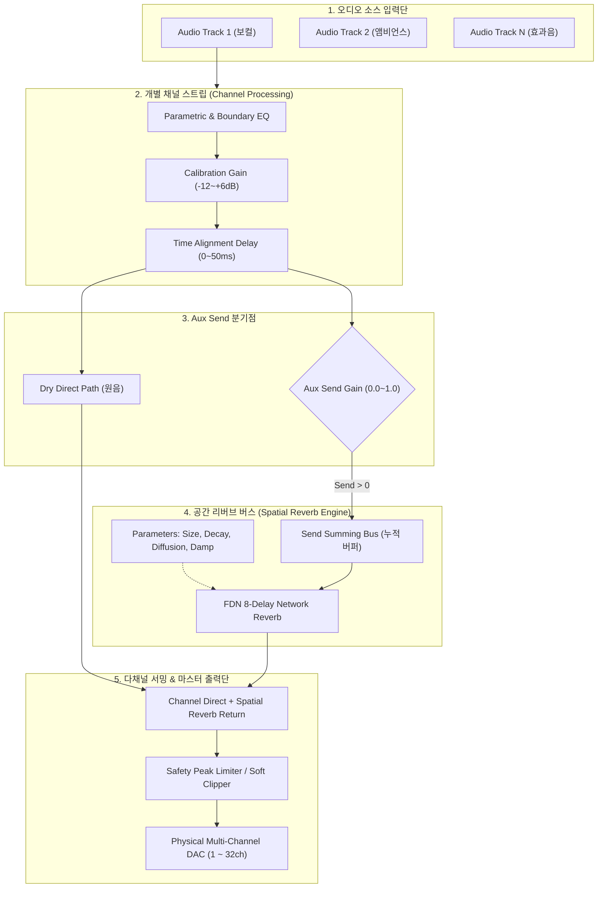

# 🏛️ 다채널 공간음향 오디오 엔진: 개별 Aux Send 리버브 버스 & 공간 연출 아키텍처 설계서

> **문서 버전**: v1.0.0 (Architecture Blueprint)  
> **대상 프로젝트**: Atmos Mixer Pro (Flutter + Rust DSP + WebGL)  
> **핵심 목적**: 스피커 시공 튜닝(Dry 신호)과 이머시브 공간 사운드 연출(Wet 신호)을 완벽히 분리 지원하는 하이브리드 멀티 버스 오디오 파이프라인 구축

---

## 1. 시스템 설계 배경 및 목적

### 1.1 현장 문제점 및 요구사항
- **기존 한계**: 기존 엔진은 헤드폰 2채널 바이노럴 출력 끝단에 일괄적인 글로벌 리버브(Global Reverb)를 적용하여, 다채널 스피커 환경에서 특정 스피커만 선택적으로 울리게 하거나 드라이(Dry)하게 유지하는 연출이 불가능했음.
- **요구사항**: 
  1. **스피커 물리 시공 & 튜닝 모드**: 순수 원음(Dry)에 대한 정밀 타임 딜레이, 게인, 경계면 EQ 캘리브레이션 지원.
  2. **전시회/방탈출 공간 연출 모드**: 채널별 독립 Aux Send 양 조절을 통해 스피커마다 개별적인 원근감 및 공간 잔향(Reverb) 형성.

```
┌────────────────────────────────────────────────────────────────────────────────────────┐
│                        [ Atmos Mixer Pro 이원화 파이프라인 개요 ]                       │
├─────────────────────────────────────────┬──────────────────────────────────────────────┤
│ 1. 시공 & 캘리브레이션 계층 (Dry Pipeline) │ 2. 이머시브 공간 연출 계층 (Wet Aux Pipeline) │
├─────────────────────────────────────────┼──────────────────────────────────────────────┤
│ • 물리 스피커 거리 역제곱 감쇠 (Gain)    │ • 채널별 독립 Aux Send 레벨 (0.0 ~ 1.0)      │
│ • 타임 얼라인먼트 (Delay, ms)           │ • 3D 공간 리버브 코어 (FDN / Plate Reverb)   │
│ • 앨리슨 효과 보정 (Boundary EQ)         │ • 룸 파라미터 연동 (Size, Decay, Diffusion) │
│ • 위상 정렬 (Phase 0° / 180°)           │ • 스피커별 다채널 리버브 분산 매트릭스       │
└─────────────────────────────────────────┴──────────────────────────────────────────────┘
```

---

## 2. 전체 오디오 신호 흐름도 (Signal Flow Architecture)

각 입력 트랙 및 스피커 노드에서 최종 DAC 물리 출력단까지의 신호 전달 흐름입니다.



---

## 3. Rust DSP 백엔드 데이터 구조 설계 (`src/rust/`)

### 3.1 채널 스트립 구조체 (`channel_strip.rs`)
각 스피커 출력 채널의 물리적 튜닝 파라미터와 연출용 Aux Send 파라미터를 관리합니다.

```rust
// rust/src/audio/channel_strip.rs

pub struct ChannelStrip {
    pub channel_id: usize,
    
    // 1. 물리 시공 & 캘리브레이션 파라미터 (Dry)
    pub cal_gain: f32,             // 거리 보정 게인 (Linear)
    pub cal_delay_samples: usize,  // 타임 얼라인먼트 딜레이 버퍼 샘플 수
    pub phase_inverted: bool,      // 위상 반전 여부
    pub boundary_filter: Biquad,   // 앨리슨 효과 보정 로우 쉘프 필터
    
    // 2. 공간 연출 파라미터 (Wet)
    pub reverb_send: f32,          // 리버브 Send 양 (0.0 ~ 1.0)
    pub is_pre_fader: bool,        // 프리/포스트 페이더 선택
    pub is_muted: bool,            // 채널 음소거
    
    // 내부 딜레이 링 버퍼
    delay_buffer: Vec<f32>,
    delay_write_ptr: usize,
}
```

### 3.2 피드백 딜레이 네트워크 리버브 코어 (`reverb_engine.rs`)
전시장 공간의 자연스러운 잔향을 생성하기 위한 8-Line FDN (Feedback Delay Network) 구조체입니다.

```rust
// rust/src/audio/reverb_engine.rs

pub struct SpatialReverbEngine {
    // 룸 어쿠스틱 파라미터
    pub room_size: f32,       // 0.1 ~ 1.0 (가상 룸 체적)
    pub decay_time: f32,      // 0.2s ~ 10.0s (RT60 잔향 시간)
    pub diffusion: f32,       // 0.0 ~ 1.0 (벽면 난반사 밀도)
    pub high_damping: f32,    // 0.0 ~ 1.0 (고음역 공기/벽면 흡음률)
    
    // 8-Line FDN 딜레이 라인 및 직교 피드백 행렬
    delay_lines: [Vec<f32>; 8],
    write_indices: [usize; 8],
    damping_filters: [OnePoleLowPass; 8],
    feedback_matrix: [[f32; 8]; 8], // Householder Matrix (에너지 보존)
}

impl SpatialReverbEngine {
    /// 단일 오디오 블록(64 샘플) 리버브 연산 수행
    pub fn process_block(&mut self, send_input: &[f32], wet_output: &mut [f32]) {
        // SIMD 가속 기반 8채널 FDN 순환 및 믹싱
    }
}
```

---

## 4. 실시간 조작 안정성: 지퍼링(Zipper Noise) 방지 스무딩

현장 엔지니어가 믹서 슬라이더나 3D 스피커 위치를 마우스로 조절할 때, 볼륨이나 딜레이가 계단식으로 변하면 **'지지직'거리는 지퍼 노이즈(Zipper Noise)**가 발생합니다. 이를 방지하기 위해 64샘플 단위 선형 보간(Linear Smoothing)을 적용합니다.

```
  [ 슬라이더 조작 시 게인 보간 곡선 ]
  Gain
   1.0 ┤                 . . . . . (목표값 도달)
       │             . '
   0.2 ┼ . . . . . '
       └─────────┬─────────┬─────────► Time (Samples)
               Frame 0   Frame 64 (1.45ms @ 44.1kHz - 무소음 완벽 전환)
```

---

## 5. 단계별 구현 및 검증 로드맵 (Execution Roadmap)

```
┌──────────────────────────────────────────────────────────────────────────────────┐
│                             [ 4단계 구현 로드맵 ]                                │
├───────────┬──────────────────────────────────────────────────────────────────────┤
│ Phase 1   │ • Rust mixer.rs에 ChannelStrip 배열 및 Aux Send 서밍 버퍼 신설       │
│ (DSP 코어)│ • 채널별 독립 Delay 링 버퍼 및 Biquad Boundary Filter 적용           │
├───────────┼──────────────────────────────────────────────────────────────────────┤
│ Phase 2   │ • FDN 8-Line Spatial Reverb DSP 엔진 구현                            │
│ (리버브)  │ • Room Size, Decay, Diffusion, High Damp 실시간 파라미터 바인딩      │
├───────────┼──────────────────────────────────────────────────────────────────────┤
│ Phase 3   │ • Flutter UI ➔ Rust FFI 양방향 통신 브릿지 확장 (apiSetChannelSend) │
│ (UI 연동) │ • 믹서 채널 스트립에 Reverb Send 원형 노브 및 Pre/Post 토글 배치     │
├───────────┼──────────────────────────────────────────────────────────────────────┤
│ Phase 4   │ • 365일 무인 전시장을 위한 세션 프리셋(JSON) 저장 및 자동 복원 검증 │
│ (안정화)  │ • 32채널 장시간 부하 테스트 (CPU 점유율 5% 이하 유지 검증)           │
└───────────┴──────────────────────────────────────────────────────────────────────┘
```

---

## 6. 결론 및 향후 기대 효과

1. **시공 엔지니어의 편의성**: 리버브가 100% 바이패스된 순수 드라이 신호로 신속하고 정확한 음향 룸 튜닝(거리/딜레이/EQ) 수행 가능.
2. **사운드 디자이너의 연출 극대화**: 방탈출, 미디어아트 씬별로 특정 스피커에만 잔향감을 부여하여 극적인 공간감과 현실감 연출 가능.
3. **업계 표준 규격 충족**: QLab, L-ISA, TiMax 등 상용 엔터프라이즈 장비와 대등한 버스 라우팅 자유도 확보.
